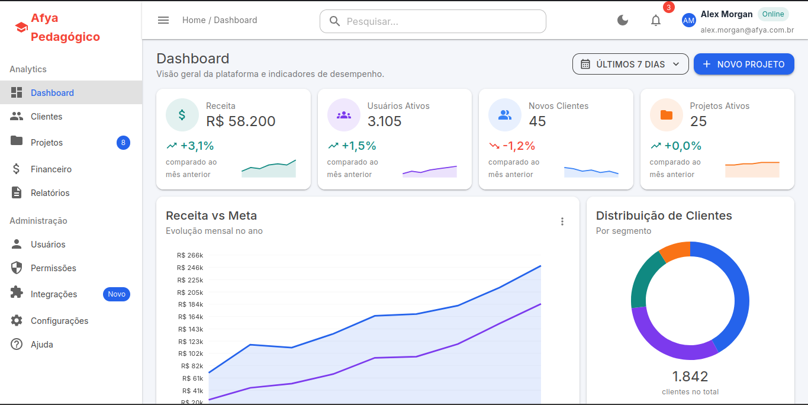
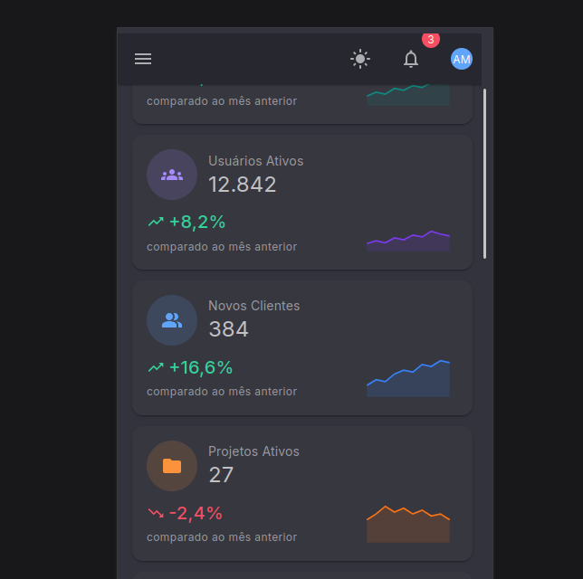
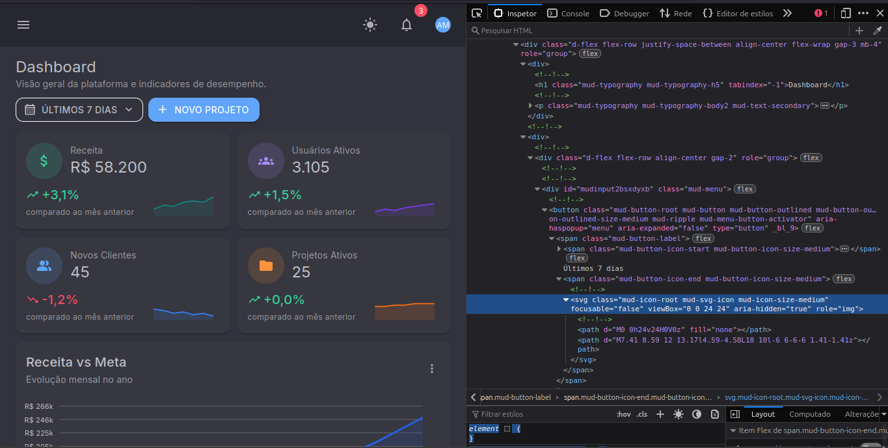

# afya-admin

Dashboard administrativo feito com **Blazor WebAssembly (.NET 10)** e **MudBlazor 9**, sem nenhuma linha de CSS próprio.

## Como executar

```bash
dotnet restore
dotnet run
```

Abra o endereço exibido no terminal (por padrão `https://localhost:xxxx`).

## Estrutura

```text
afya-admin/
├── Components/   componentes reutilizáveis (cards, gráficos, listas) + Ui.cs
├── Data/         modelos (records) e dados fictícios do dashboard
├── Layout/       MainLayout (tema, AppBar, Drawer) e NavMenu
├── Pages/        Dashboard (rota "/") e NotFound
├── wwwroot/      index.html, app.css (sem regras) e imagens
└── docs/prints/  tema-claro.png, tema-escuro.png, mobile.png, devtools.png
```

## Telas

| Tema claro | Tema escuro |
| --- | --- |
|  |  |

| Mobile | DevTools |
| --- | --- |
|  |  |

## O que aprendi

### 1. Como o Blazor WebAssembly inicia?
O navegador carrega o `wwwroot/index.html`, que exibe a tela de carregamento inicial no elemento `<div id="app">`. Em seguida, o runtime .NET via WebAssembly baixa as DLLs compiladas do C# e executa o `Program.cs`. A instrução `builder.RootComponents.Add<App>("#app")` substitui o indicador de carregamento pela aplicação Blazor e pelo roteador configurado no `App.razor`.

### 2. Qual a diferença entre Layout, Page e Component?
- **Layout (`MainLayout.razor`):** define a estrutura visual comum a várias telas, como o menu lateral (`MudDrawer`) e a barra superior (`MudAppBar`).
- **Page (`Dashboard.razor`):** é a página mapeada por uma rota `@page "/"`, responsável por estruturar os elementos da tela e consumir componentes.
- **Component (`KpiCard.razor`):** um bloco visual encapsulado, reutilizável e parametrizado para exibir informações específicas de forma modular.

### 3. Para que serve o `RenderFragment`?
O `RenderFragment` permite que um componente Blazor receba um bloco completo de marcação HTML e subcomponentes como parâmetro. O `DashboardCard` utiliza esse recurso no `ChildContent`, no `Menu` e nas `Acoes`, permitindo personalizar o conteúdo interno sem ter que recriar o cabeçalho e os cantos do card.

### 4. Como funciona o `@bind-Valor` no `SeletorPeriodo`?
O parâmetro `@bind-Valor` faz um bind bidirecional. O componente recebe o valor atual pela propriedade `Valor`. Quando uma opção é selecionada, o componente dispara o manipulador de eventos `ValorChanged.InvokeAsync(opcao)`, notificando a página pai para atualizar a variável associada.

### 5. Por que separar a pasta `Data`?
A pasta `Data` isola os dados das regras visuais dos componentes. Essa separação facilita a manutenção e possibilita trocar os dados mockados por chamadas REST a uma API backend no futuro (usando `HttpClient`), mantendo os componentes visuais totalmente intactos.

### 6. Como a responsividade funciona no `MudGrid` (`xs`, `sm`, `lg`)?
O `MudGrid` baseia-se no sistema flexbox de 12 colunas. Ao definir `xs="12" sm="6" lg="3"` nos cards de KPI, dizemos ao layout para ocupar 12 colunas em telas pequenas (1 card/linha), 6 colunas em tablets (2 cards/linha) e 3 colunas em telas grandes (4 cards/linha).

### 7. Como foi feita a estilização sem CSS e qual o papel do `MudTheme`?
Toda a estilização foi feita aproveitando o sistema de temas (`MudTheme`) e as classes utilitárias nativas do MudBlazor. O `MudTheme` centraliza as paletas de cores (modo claro e escuro), fontes e raios de borda, enquanto classes como `pa-4`, `d-flex` e `mud-text-secondary` resolvem alinhamentos, margens e cores pontuais.

### 8. Por que o namespace é `afya_admin` e não `afya-admin`?
O C# não permite o uso do caractere de hífen `-` em identificadores de código (pois o compilador interpreta como operador de subtração). Por essa razão, o .NET substitui o hífen pelo caractere de sublinhado `_`, definindo o namespace padrão do projeto como `afya_admin`.
